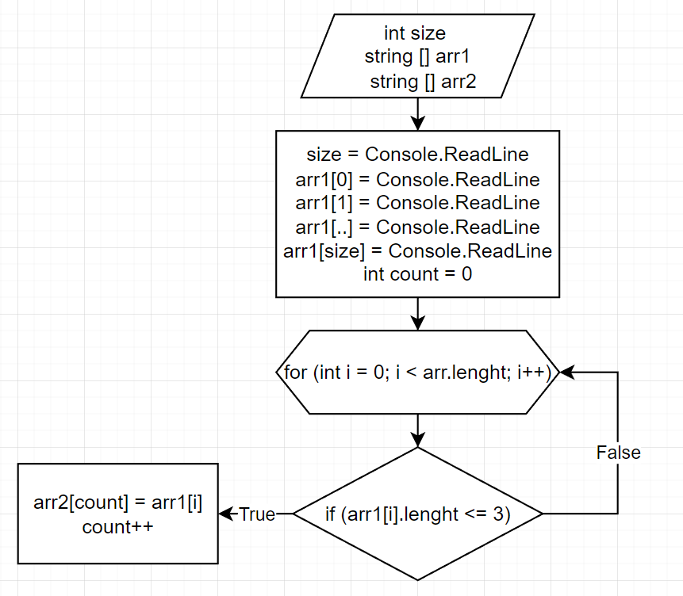

# **Задача**
```
Написать программу, которая из имеющегося массива строк формирует массив из строк, длина которых меньше либо равна 3 символа. Первоначальный массив можно ввести с клавиатуры, либо задать на старте выполнения алгоритма. При решение не рекомендуется пользоваться коллекциями, лучше обойтись исключительно массивами
```
# **Описание выполнения**
```
-Просим пользователя указать длину массива.
-Просим пользователя присвоить значение каждой переменной массива
-Создаем 2-ой маассив, куда будем присваивать нужные нам значения.
-Создаем метод, в котором будут перебираться все эллементы массива пользователя. После с помощю условия выбираем нужные нам эллементы и записываем во 2-ой масиив.
-Выводим наш массив, если в предидущем массиве небыло нужных нам значений, выводим сообщение об этом.
```

# **Блок-схема алгоритма выполнения задачи.**

